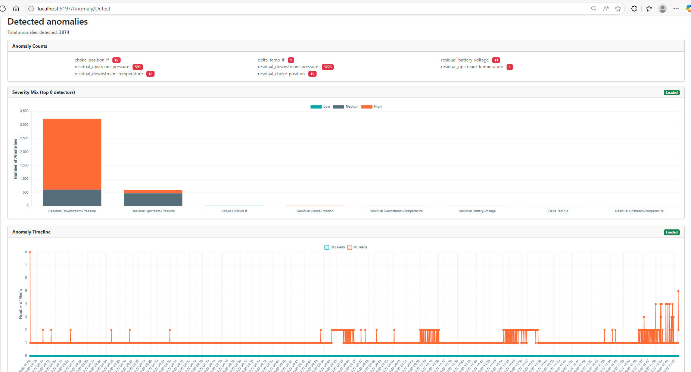

# PulseEight ICV — SIT Anomaly Triage (ONNX/.NET)


*Fig. A. Ingest (DataHub/CSV) → Preprocess → Ensemble → Thresholding → Dashboard/PDF.*

This repo contains the code and artifacts for a physics-informed, **unsupervised** anomaly detection of **PulseEight Interval Control Valve (ICV)** System Integration Tests (SIT).  
It ingests 1 Hz workshop telemetry, runs a small ensemble (Isolation Forests + XGB residuals), and produces **standardised PDF evidence** from a .NET web app.

---

## Why this exists 
Engineers currently review long SIT traces by eye. Subtle issues (e.g., repeated readings, ΔT divergence, target–actual mis-tracking) are easy to miss and reviews take time. This project automates **low-nuisance** anomaly flagging and **evidence capture** before tools go offshore.

## Features
-  **Data sources:** AVEVA CONNECT data services (formerly Data Hub) streams or CSV
-  **Models:** 1D ΔT IF, 2D pressure-pair IF, 3D position-state-temp IF, 7D multi-sensor IF, XGB residuals, and a data-quality watchdog
-  **Deployment:** ONNX Runtime (.NET) with ~120 events/s throughput and ~14 MB footprint
-  **Outputs:** web dashboard + **one-click PDF** (QuestPDF) with traces, flagged events, and thresholds
-  **Batch/near-real-time:** not hard real-time; designed for SIT runs

## Repo layout
```
	├─ TAQA_Deployment/        # .NET web app (controllers, services, dashboard)
	├─ TAQA_Model_Development/ # EDA & training notebooks, model dev
	├─ TAQA-InferenceAPI/      # FastAPI Python service for inference
	├─ models_4/               # ONNX models (versioned)
	├─ deliverables/           # Project deliverables
	├─ logbook/                # Project logbook
	├─ title/                  # Project title and metadata
	├─ docs/                   # diagrams, figures, README images
	└─ README.md
```

## Quick start
1) **Prereqs:** .NET 6.0, ONNX Runtime, (optional) Python 3.11 for training.  
2) **Config:** copy `appsettings.Example.json` ; `appsettings.json` and set your **CONNECT** tenant, client id/secret.  
3) **Run:** `dotnet run` then open ⟨http://localhost:8000⟩.  
4) **Try it:** upload a CSV sample from `data/mock/` or point to a Stream ID.

> Data are proprietary to TAQA; only figures are included here.

## How it works (1-minute tour)

The app aligns and cleans 1 Hz streams (repeats/zeros/≈12000 filtered, log1p/robust scaling), computes ΔT/ΔP, and passes features to an ONNX ensemble.  
Thresholds are set by a simple **Score-Exceedance Rate** budget. Point flags are grouped into **events** (with a short run-length rule) and written to the PDF.

## Results (short, factual)
- Mean **F1 ≈ 0.93** on a labelled hold-out tool (n≈500 labels); **ΔT-IF F1 ≈ 0.993**.  
- Runtime: **~120 events/s**, **~14 MB**; batch of ~6,998 rows in **58,385 ms** (~8–9 ms/row when batched).

## Model artifacts
- `models/if_deltaT.onnx` — 1D ΔT Isolation Forest  
- `models/if_pressures.onnx` — 2D pressure-pair IF  
- `models/if_pos_state_temp.onnx` — 3D IF  
- `models/if_multi7.onnx` — 7D IF  
- `models/xgb_residual_*.onnx` — residual predictors

> Each model’s input schema is listed in `models/manifest.json`.

## Limitations & notes
- Single-company SIT data; labels from one tool; designed for batch/near-real-time triage.  
- Not a closed-loop controller. Use as **decision support**. To include feedback loop for retraining

## License
Private to TAQA

## Contact
Ashwin V · ashwin.vel24@imperial.ac.uk · [linkedin.com/in/ashwinvel2000](https://linkedin.com/in/ashwinvel2000)
